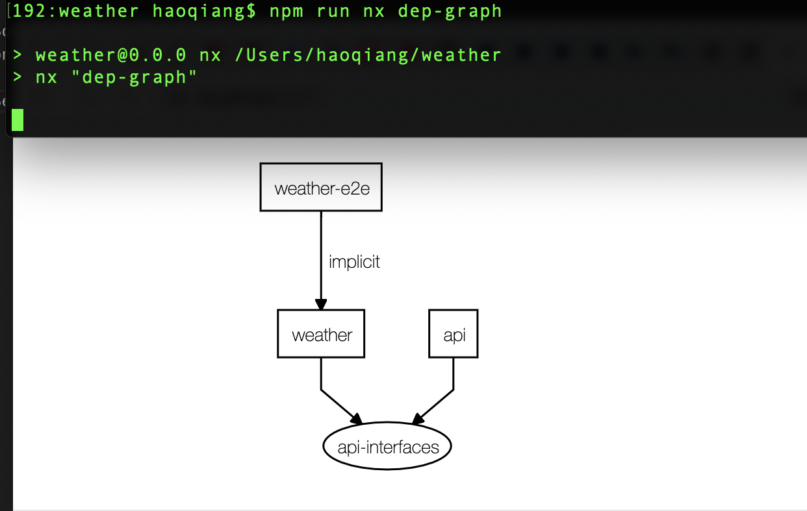

# Weather Desgin
Before I was doing this project I was think if there is a easy way to build a full-stack application using the same tech stack like Typescripts or Javascript, and not only this, but we want to build it very easy and quick. and finally we can build software like facebook, google or microsoft. 
and finlly this is a monorepos built on the [NX](https://nx.dev)

With Nx, you can:

- Use modern tools like Cypress, Jest, Prettier, TypeScript, and others.
- Build full-stack applications using Angular, and Node.js.
- Use effective development practices pioneered at Google, Facebook, and Microsoft.

# data model and application structures
As a front-end developer, we need to build data model for ourself, and we have to do the samething if we are back-end developer. and sometimes,  we met issues if the data model is changed from back-end and front-end developer didn't know it.

So, here, base on [NX](https://nx.dev) we found a easy way to share the data model, not only share the data model, but also share the code, it means front-end and back-end can use one same data model / code, and share it. just one place to update it if we need to change the data model / code.

See the screenshot below which is generated by the [NX](https://nx.dev):

<p align="center"></p>

You can see, The projects(workspace) divided to 2 parts. one front-end application built on Angular framework called weather, and one back-end application build on NestJs framework called api. and they were sharing a lib whichk called api-interfaces. and yes, this one is our data model.

what appi-interfaces look like:
```
export interface CurrentWeather {
  city: string;
  upd_time: string;
  weather: string;
  temperature: string;
  wind: string;
}
```
it is just a typescript interface and will be passed by server side and client side by Json format.

the application named api is built on NestJS. 

Nest (NestJS) is a framework for building efficient, scalable Node.js server-side applications. It uses progressive JavaScript, is built with and fully supports TypeScript (yet still enables developers to code in pure JavaScript) and combines elements of OOP (Object Oriented Programming), FP (Functional Programming), and FRP (Functional Reactive Programming).

To design a back-end service, we want to it provide a RESTful service,  for this project, it should be a very easy one, just a GET request with a parameter like city to query the current weather.

that is very easy to add code in NestJS to implement it. just add some code in its controller:

```
import { CurrentWeather } from '@weather/api-interfaces';
// shared code / data model

@Controller('weather')
export class AppController {
  constructor(private readonly appService: AppService) {}

  @Get(':city')
  getData(@Param() params): CurrentWeather {
    return this.appService.getData(params.city);
  }
}
```
So the URL will be http://localhost:3333/api/weather/#cityname#, when we get a request with a city name in this app, we just need to query the weather data by its city. 


Because this is a monorepos, so we want to resue the back-end node server, so when user access the server, we also can return the front-end code to their browser. the files generated by angular will be put into dist directory, so only need to  sent it to users browser by NestJS, what we did like below:

```
// file: \weather\apps\api\src\app\app.module.ts
 ServeStaticModule.forRoot({
      rootPath: join(__dirname, '..', 'dist'),
    }),
```

#Front-end

Here I am not going to introduce to much about the front-end part, because it's just built on the Angular framework, just a HTTP GET request. and a form.

thanks.
